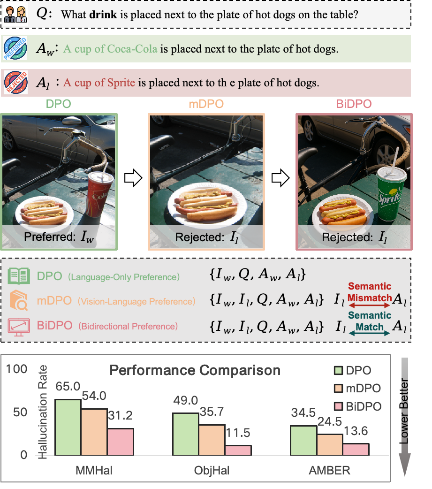
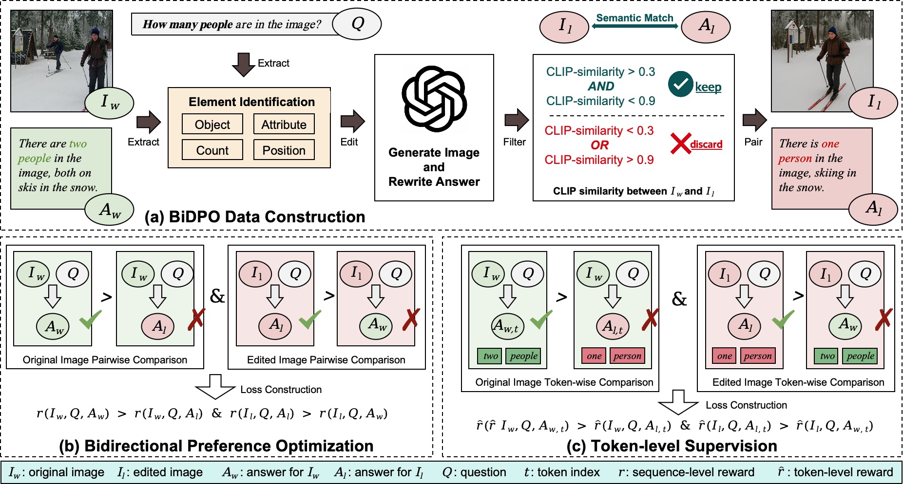

# BiDPO

## Overview

**BiDPO** (Bidirectional Preference Optimization with Token-level Supervision) is a novel framework designed to align Vision-Language Models (VLMs) more effectively by addressing visual hallucination and improving fine-grained grounding.

Traditional preference optimization methods, such as DPO and mDPO, mainly focus on text-level alignment and coarse image perturbations, often overlooking subtle but decisive visual details. BiDPO proposes a semantics-driven, bidirectional preference optimization strategy combined with token-level supervision, systematically improving the model's sensitivity to key visual cues and substantially reducing hallucination.

**Key features of BiDPO:**
- *Semantics-driven, minimal contrastive data construction*: Generates targeted image pairs by editing only question-relevant features (object, attribute, count, position, etc.).
- *Bidirectional preference optimization*: Enforces correct image-answer alignment in both directions to suppress shortcut learning and hallucinations.
- *Token-level reward and regularization*: Guides the model to ground each generated token in visual evidence for finer-grained alignment.

<p align="center">
  <b>Figure 1: Comparison of Preference Optimization Strategies for Vision-Language Alignment</b><br>
  
</p>

The BiDPO framework consists of three major components: BiDPO data construction, bidirectional preference optimization, and token-level reward regularization.

<p align="center">
  <b>Figure 2: Overall Framework of BiDPO</b><br>
  
</p>

For more technical details and results, please refer to our paper.

## Install
Create an S-VCO environment running on CUDA 11.8 by:
```bash
conda create -n bidpo python=3.10
conda activate bidpo
conda install conda-forge::cudatoolkit-dev
bash env/install_bidpo_env.sh
source activate bidpo
cp env/transformers4.45.2_modeling_llava_modified.py "$CONDA_PREFIX/lib/python3.10/site-packages/transformers/models/llava/modeling_llava.py"
cp env/trl0.7.2_core_modified.py "$CONDA_PREFIX/lib/python3.10/site-packages/trl/core.py"
```
## Dataset Construction

To construct the BiDPO dataset, please run the following three scripts in order under the `data/` directory:

1. **step1_label.py**  
   This script identifies the semantic focus (such as object, attribute, count, or position) for each question in the original image-question pairs.  
   *Input*: Raw image-question pairs  
   *Output*: Labeled pairs with semantic focus annotations

2. **step2_generate.py**  
   Based on the semantic focus, this script generates minimal, question-guided contrastive images and corresponding answers (e.g., by editing object, attribute, count, or position).  
   *Input*: Labeled pairs from step 1  
   *Output*: Candidate contrastive image-question-answer pairs

3. **step3_filter.py**  
   This script automatically filters the generated pairs using CLIP similarity to ensure that each pair maintains global semantic consistency while presenting a clear, localized difference in the targeted visual feature.  
   *Input*: Candidate pairs from step 2  
   *Output*: Final high-quality BiDPO dataset

### Usage

Run the following commands in order:

```bash
python data/step1_label.py
python data/step2_generate.py
python data/step3_filter.py
```


## Training
We provide an example script to run bidpo on LLaVA-1.5-7B using 8 A100x80G GPUs:
```bash
bash run_dpo_example.sh
```